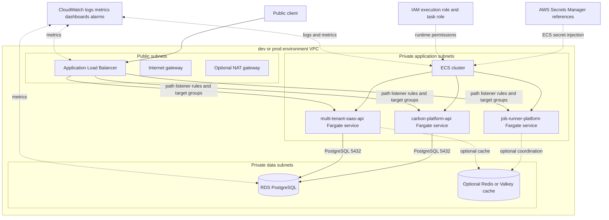

# Architecture

This document describes the public-safe AWS container platform architecture modeled by `platform-infra-lab`. It is intended for code review, portfolio review, and validation-only CI. It does not contain employer/private details, real account identifiers, real hostnames, credentials, Terraform state, or generated plans.

Related references:

- [AWS container platform diagram](diagrams/aws-container-platform.md)
- [Service example catalog](service-examples.md)
- [Secret reference pattern](secrets.md)
- [Terraform environments](../infra/terraform/environments/README.md)
- [Terraform modules](../infra/terraform/modules/README.md)

## Architecture summary

The lab models one AWS environment at a time, with the same module set wired by separate `dev` and `prod` Terraform roots:

1. A VPC contains public subnets for the load-balancer edge and private subnets for workloads and stateful services.
2. An internet-facing Application Load Balancer is the only public ingress path.
3. ECS/Fargate services run in private subnets and receive traffic only from ALB listener rules and target groups.
4. Private PostgreSQL/RDS is reachable only from the ECS service security group.
5. Optional private Redis/ElastiCache is reachable only from the ECS service security group when enabled.
6. CloudWatch log groups, metrics, dashboards, and alarms provide reviewable observability signals.
7. IAM separates ECS task execution duties from application runtime permissions.
8. Secret values are not stored in Terraform. The configuration passes AWS Secrets Manager references into ECS task definitions.



## VPC/subnet layout

The network module creates a VPC per environment with explicit public and private subnet intent.

| Environment | VPC CIDR | Subnet layout | NAT posture | Intent |
| --- | --- | --- | --- | --- |
| `dev` | `10.20.0.0/16` | two public and two private subnets | disabled by default | cost-aware review with private workloads and no default private internet egress |
| `prod` | `10.30.0.0/16` | three public and three private subnets | enabled by default | production-intent multi-AZ layout with private egress pattern shown |

Public subnets host internet-facing edge resources such as the ALB and, when enabled, a NAT gateway. Private subnets host ECS tasks, RDS PostgreSQL, and optional Redis/Valkey cache resources. The module creates an internet gateway, a public route table, and one private route table per private subnet. When NAT is disabled, private route tables do not receive an internet default route.

This layout keeps public ingress separate from application and data tiers. It also makes the cost trade-off visible: NAT can be required for private outbound access, but it can create ongoing cost if a user later provisions the example in a real account.

## ALB/public edge

The load-balancer module models the public edge:

- an internet-facing Application Load Balancer in public subnets by default
- a required HTTP listener with a fixed-response default action for unmatched paths
- optional HTTPS listener variables, kept disabled in committed examples because no real certificate ARN belongs in this public repo
- optional access-log references, kept disabled unless a user-owned bucket is supplied outside this repo
- outputs for listener ARNs and CloudWatch metric dimensions

The ALB security group accepts public ingress only on configured listener ports. ECS services are not directly public. Each service owns a target group and an ALB listener rule with explicit path patterns:

| Service | Example listener paths | Health path |
| --- | --- | --- |
| `carbon-platform-api` | `/carbon*`, `/carbon/*` | `/health` |
| `job-runner-platform` | `/jobs*`, `/jobs/*` | `/healthz` |
| `multi-tenant-saas-api` | `/saas*`, `/saas/*` | `/ready` |

The fixed default response prevents unmatched traffic from accidentally reaching a backend service.

## ECS private service placement

The ECS service module models one private Fargate service per portfolio app. Each environment creates a shared ECS cluster and instantiates the service module for:

- `carbon-platform-api`
- `job-runner-platform`
- `multi-tenant-saas-api`

The services use fake image names under `public.ecr.aws/example/...:demo`. No application source code is copied into this repository.

Important placement and runtime details:

- Fargate tasks use private subnet IDs from the network module.
- `assign_public_ip` is disabled in the service module.
- The ECS service security group accepts traffic only from the ALB security group on the application port.
- Each service has its own task definition, target group, listener rule, container health check, target-group health check, CloudWatch log group, deployment circuit breaker, and desired-count autoscaling settings.
- Non-secret environment variables are placeholders only.
- Secret references are passed as ARNs for ECS task-definition secret injection, not as values.

Dev keeps task counts and autoscaling ranges small for review. Prod uses larger desired counts and wider autoscaling ranges to show production intent.

## RDS private placement

The RDS PostgreSQL module models a private database tier:

- the DB subnet group uses private subnets only
- the RDS instance fixes public accessibility to false
- the RDS security group accepts PostgreSQL traffic only from the ECS service security group on port `5432`
- RDS manages the master user password in AWS Secrets Manager
- Terraform exposes the master user secret ARN as a reference only
- backup retention, storage autoscaling ceiling, deletion protection, final snapshot behavior, log exports, and monitoring-related settings are explicit variables

Dev models a small single-AZ PostgreSQL instance with short backup retention and deletion protection disabled for disposable lab experiments. Prod models Multi-AZ, longer retention, deletion protection, final snapshot behavior, and Performance Insights to show production-intent safeguards.

Database schema migrations are intentionally not automated by this repo. A real workload should run migrations as a separate reviewed deployment activity with rollback planning.

## Optional Redis private placement

The Redis cache module models an optional private Redis/Valkey-style cache tier:

- the cache subnet group uses private subnets only
- the cache security group accepts traffic only from the ECS service security group on the configured Redis port
- dev disables Redis by default to avoid unnecessary lab cost
- prod enables Redis by default to demonstrate the optional private cache tier with one replica, Multi-AZ/failover intent, encryption settings, snapshots, and final snapshot behavior
- endpoint outputs are connection references, not credentials

No Redis AUTH token, ACL secret, or cache credential value is stored in Terraform. A real design should add reviewed secret references and rotation ownership outside this public repository.

## Security group traffic boundaries

| Source | Destination | Port | Boundary intent |
| --- | --- | --- | --- |
| Public IPv4 CIDRs | ALB security group | HTTP by default | public users reach only the load-balancer edge |
| ALB security group | ECS service security group | application port `8080` by default | only the ALB can reach private service tasks |
| ECS service security group | RDS PostgreSQL security group | `5432` | services can reach the private database |
| ECS service security group | Redis cache security group | `6379` when enabled | services can reach the private cache only when the cache tier is enabled |

There is no public ingress rule for PostgreSQL or Redis. The current ECS egress model is intentionally narrow. Real workloads that need AWS APIs, image pulls, log delivery, or third-party outbound calls should add reviewed VPC endpoints, NAT egress, or more specific egress rules.

## CloudWatch logs/metrics

The observability module models environment-level CloudWatch visibility:

- one CloudWatch dashboard per environment
- ALB 5xx alarm
- per-service unhealthy target alarms
- per-service ECS CPU alarms
- per-service ECS memory alarms
- RDS CPU alarm
- RDS free storage alarm
- dashboard widgets for ALB latency/errors, target health, ECS CPU/memory, RDS health, and recent ECS service logs

ECS service logs use the naming convention:

```text
/aws/ecs/<name-prefix>/<service-name>
```

Committed examples keep CloudWatch alarm action lists empty. Real SNS topics, incident-routing ARNs, paging policies, and private escalation details belong in user-owned configuration outside this public repo.

## IAM roles

The IAM module separates runtime responsibilities:

- **ECS task execution role** — used by ECS to pull images, write logs, and resolve task-definition secret references.
- **Application task role** — assumed by application code at runtime. It starts with no broad direct secret-read permissions unless explicit user-owned reference ARNs are supplied.

The IAM module scopes secret-reference policies from module-created Secrets Manager ARNs and optional extra ARNs supplied by a user-owned environment. It does not hard-code real secret ARNs or account identifiers.

## Secret references

Secret handling uses references, not values:

- `infra/terraform/modules/secrets-manager-references` creates metadata-only `aws_secretsmanager_secret` resources.
- It does not create `aws_secretsmanager_secret_version` resources.
- It does not accept secret strings.
- ECS task definitions receive secret ARNs for runtime injection.
- Secret values must be created outside this public repository or by a secure user-owned pipeline.

Modeled service references include `DATABASE_URL`, `JOB_RUNNER_API_KEY`, and `JWT_SIGNING_KEY` as placeholder names only. See [the secret reference pattern](secrets.md) for details.

## Environment separation

`dev` and `prod` are separate Terraform roots under `infra/terraform/environments/`. They use the same modules but different defaults and examples:

| Area | `dev` posture | `prod` posture |
| --- | --- | --- |
| Availability zones | two | three |
| NAT gateway | disabled by default | enabled by default |
| ECS desired count | one task per service | two tasks per service |
| RDS | small single-AZ, short retention | Multi-AZ, longer retention, deletion protection |
| Redis | disabled by default | enabled by default |
| ALB deletion protection | disabled | enabled |
| Alarm actions | empty | empty |

Each environment includes `backend.example.tf` and `terraform.tfvars.example` only. Real backend configuration, real `.tfvars`, state files, generated plans, credentials, and private names must not be committed.

## Request flow

A typical HTTP request follows this path:

1. A public client sends a request to the ALB DNS name.
2. The ALB listener evaluates explicit path rules such as `/carbon*`, `/jobs*`, or `/saas*`.
3. Matching traffic is forwarded to the target group owned by the corresponding ECS service module instance.
4. The target group sends the request to a healthy Fargate task in a private subnet.
5. The task uses non-secret environment variables and ECS-injected secret values resolved from secret references at runtime.
6. If needed, the task connects to private PostgreSQL or optional private Redis through security group references.
7. The task writes application logs to its CloudWatch log group.
8. ALB, ECS, and RDS metrics feed the CloudWatch dashboard and alarms.

If no listener rule matches, the ALB returns its fixed default response instead of forwarding traffic to a service.

## Deployment flow

This repository keeps deployment automation validation-only. The intended review flow is:

1. Change Terraform module code, environment inputs, or a fake service image reference in a branch.
2. Run `bash scripts/quality-gate.sh` locally.
3. Open a pull request and let GitHub Actions run the same validation-only quality gate.
4. Review Terraform formatting, validation output, public-safety guardrails, no-state/no-plan checks, no cloud-mutation automation checks, and documentation link sanity checks.
5. In a user-owned account only, an operator may separately initialize Terraform, review a plan, and decide whether optional manual provisioning is appropriate.
6. If a real ECS image update is provisioned manually, ECS replaces tasks behind the ALB target group while health checks and the deployment circuit breaker control rollout safety.
7. After rollout, the operator checks ALB target health, service logs, ECS CPU/memory, ALB 5xx/latency, and RDS health.

CI does not configure cloud credentials and does not run cloud mutation commands. Any real provisioning is optional, manual, user-owned, and can incur cost.

## Implemented Terraform modules

| Module | Architecture responsibility |
| --- | --- |
| [`network`](../infra/terraform/modules/network/README.md) | VPC, public/private subnets, route tables, internet gateway, optional NAT gateway |
| [`security-groups`](../infra/terraform/modules/security-groups/README.md) | ALB, ECS, PostgreSQL, and optional Redis traffic boundaries |
| [`load-balancer`](../infra/terraform/modules/load-balancer/README.md) | Public ALB edge, listeners, optional HTTPS/access-log wiring |
| [`ecs-service`](../infra/terraform/modules/ecs-service/README.md) | Private Fargate service, task definition, target group, listener rule, logs, health checks, autoscaling |
| [`rds-postgres`](../infra/terraform/modules/rds-postgres/README.md) | Private PostgreSQL/RDS instance, DB subnet group, backups, deletion protection, RDS-managed credential reference |
| [`redis-cache`](../infra/terraform/modules/redis-cache/README.md) | Optional private Redis/Valkey cache, subnet group, encryption, replicas, snapshots |
| [`iam`](../infra/terraform/modules/iam/README.md) | ECS execution role, application task role, secret-reference read policy boundaries |
| [`secrets-manager-references`](../infra/terraform/modules/secrets-manager-references/README.md) | Metadata-only Secrets Manager secret containers and ECS reference outputs |
| [`observability`](../infra/terraform/modules/observability/README.md) | CloudWatch dashboard, alarms, log group naming convention, metric coverage |

## Production hardening gaps

This lab is intentionally reviewable rather than production-complete. Before real use, review at least:

- HTTPS-only ingress, ACM certificate ownership, DNS, and WAF strategy
- per-service task roles and least-privilege AWS API permissions
- VPC endpoints or NAT design for private image pulls, logs, secret resolution, and AWS APIs
- ALB access logs, VPC flow logs, log retention, encryption, and sensitive-data handling
- real alarm actions, paging, runbook links, and incident-routing ownership
- Redis AUTH/ACLs, cache parameter groups, and cache-specific alarms
- database migration tooling, backup restore testing, maintenance windows, and credential rotation
- image provenance, vulnerability scanning, SBOM/signing, and deployment approvals
- cleanup planning to avoid accidental cloud spend

No private system names, real AWS account IDs, internal hostnames, screenshots, or non-public architecture belong in this document.
