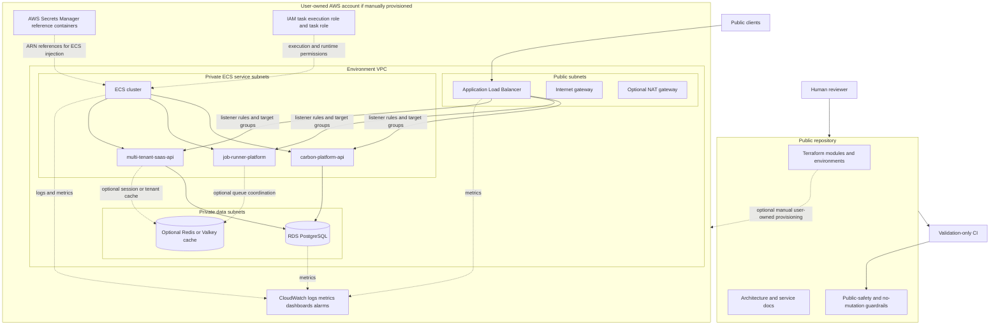
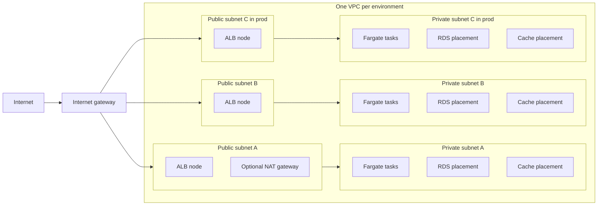
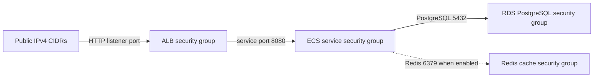
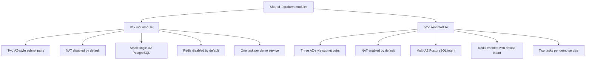
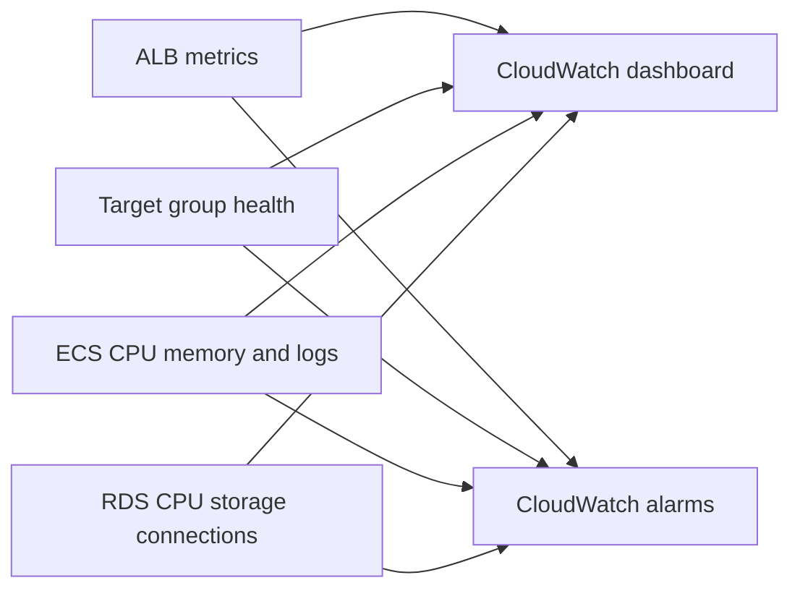

# AWS container platform diagram

These diagrams describe the public-safe AWS/Terraform architecture modeled by this repository. They are text/Mermaid diagrams only; they do not contain private hostnames, real account identifiers, real resource names from private systems, credentials, Terraform state, or screenshots.

See [the architecture guide](../architecture.md) for the narrative version.

## High-level platform



## Network layout



`dev` uses two public/private subnet pairs and disables NAT by default. `prod` uses three public/private subnet pairs and enables one shared NAT gateway by default to demonstrate private egress intent.

## Security group boundaries



PostgreSQL and Redis do not accept public ingress. Private service-to-data access uses security group references instead of broad public CIDR ranges.

## Request flow

```mermaid
sequenceDiagram
  autonumber
  participant Client as Public client
  participant ALB as Application Load Balancer
  participant TG as Service target group
  participant ECS as Private Fargate task
  participant Secrets as Secrets Manager references
  participant DB as Private RDS PostgreSQL
  participant Cache as Optional private Redis or Valkey
  participant CW as CloudWatch

  Client->>ALB: HTTP request for a service path
  ALB->>ALB: Match listener rule such as /carbon*, /jobs*, or /saas*
  ALB->>TG: Forward to the matching target group
  TG->>ECS: Send request to a healthy private task
  Note over ECS,Secrets: Referenced secrets are resolved for the task by ECS runtime; Terraform stores ARNs only
  ECS->>DB: Query PostgreSQL if the service requires database access
  ECS-->>Cache: Use Redis or Valkey when the cache tier is enabled and required
  ECS-->>CW: Emit application logs and ECS metrics
  ALB-->>CW: Emit ALB metrics and target health
  DB-->>CW: Emit RDS metrics
  ECS-->>TG: Return service response
  TG-->>ALB: Return target response
  ALB-->>Client: Return public response
```

If a request path does not match a service listener rule, the ALB returns its fixed default response instead of forwarding to a backend.

## Deployment flow

```mermaid
flowchart LR
  Change[Change Terraform or service image reference]
  LocalGate[Run local quality gate]
  PR[Open pull request]
  CI[GitHub Actions validation-only quality gate]
  Review[Review Terraform and docs]
  Plan[Optional user-owned plan review]
  Manual[Optional manual user-owned provisioning]
  Rollout[ECS deployment updates tasks]
  Verify[Check health logs metrics alarms]

  Change --> LocalGate
  LocalGate --> PR
  PR --> CI
  CI --> Review
  Review --> Plan
  Plan --> Manual
  Manual --> Rollout
  Rollout --> Verify
```



The repository automates validation only. It does not configure cloud credentials in CI and does not run cloud mutation commands. Any real provisioning is optional, manual, user-owned, and can incur cost.

## Environment separation



Both environments keep backend configuration and variable values public-safe by committing only `backend.example.tf` and `terraform.tfvars.example` files.

## Observability coverage



Committed alarm actions are empty. Real paging, SNS, or incident-routing ARNs belong in user-owned configuration outside this public repository.
